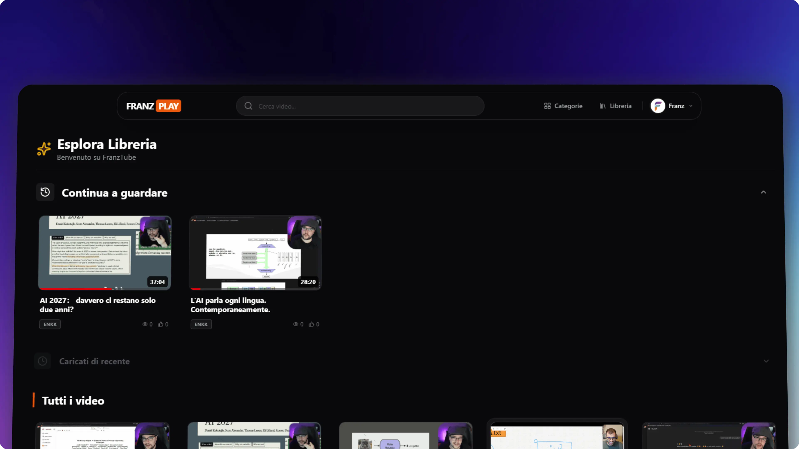

# FranzPLAY



FranzPLAY è una piattaforma di video streaming self-hosted (clone YouTube/Netflix) progettata per essere leggera e performante, ottimizzata specificamente per hardware embedded come il **Raspberry Pi 4**.

## 🚀 Filosofia "Drop & Watch"
Il cuore del progetto è l'automazione: basta caricare un video via FTP/SMB nella cartella monitorata e il sistema gestisce tutto il resto (ingestione, metadati, generazione locandine/anteprime e streaming).

## ✨ Funzionalità Chiave
*   **Ottimizzazione RPi4**: Architettura progettata per risorse limitate (caching Redis, streaming Nginx zero-copy).
*   **Smart Resume**: Riprende la visione dal punto interrotto (-3 secondi di rewind context).
*   **Automazione Python**: 3 processi background (Watcher, Meta, Assets) gestiscono l'ingestione e la sincronizzazione del filesystem.
*   **Interfaccia Moderna**: Frontend reattivo in **React 19** (Vite) con **Tailwind CSS v4**.
*   **Sicurezza**: Autenticazione session-based, protezione anti-spam e gestione utenti/admin.

## 🛠️ Tech Stack
L'infrastruttura è definita via **Docker Compose** (7 container):

| Servizio | Tecnologie | Ruolo |
| :--- | :--- | :--- |
| **Frontend** | React 19, Vite 7 | UI/UX SPA, Hot-reload in dev |
| **Web Server** | Nginx Alpine | Gateway, SSL, Streaming Delegate |
| **Backend** | PHP 8.2 Nativo | API Stateless, Logica di business |
| **Database** | MariaDB (MySQL) | Persistenza dati strutturati |
| **Cache** | Redis Alpine | Caching Query & Sessioni PHP |
| **Automation** | Python 3.9 | Watcher Filesystem, FFmpeg processing |

## 📦 Installazione & Avvio

### Prerequisiti
*   **Docker & Docker Compose** installati (fondamentali per l'ambiente).
*   **Git** installato nel sistema.

### 🔧 Tutorial di Configurazione e Primo Avvio
Per configurare da zero il progetto sul tuo computer/server e avviarlo per la prima volta, segui questi semplici passaggi:

1. **Clona la Repository**
   Scarica il codice sorgente aprendo il tuo terminale e lanciando:
   ```bash
   git clone https://github.com/FranzGra/FranzPLAY.git
   cd FranzPLAY
   ```

2. **Crea il file di ambiente (.env)**
   Nella directory principale del progetto, crea un file vuoto e chiamalo `.env`. Questo file non è incluso nella repo pubblica per sicurezza, ma è indispensabile perché definisce le credenziali del database.
   Incolla al suo interno le seguenti configurazioni (puoi modificarle a piacere):
   ```env
   # Credenziali Database MariaDB
   MYSQL_ROOT_PASSWORD=la_tua_password_root
   MYSQL_DATABASE=FranzPLAY_DBMS
   MYSQL_USER=tuo_username
   MYSQL_PASSWORD=tua_password
   ```

3. **Crea la cartella per ospitare i tuoi Video**
   I container di automazione (Watcher) cercano di default una cartella sorgente in cui ascolteranno i nuovi inserimenti multimediali. Creala con:
   ```bash
   mkdir testVideo
   ```

4. **Avvia l'ambiente con Docker**
   Lancia tutti i servizi necessari (Frontend, Nginx, PHP, MariaDB, Redis, Script Python) con un solo comando. Al primo avvio, Docker scaricherà le dipendenze e avvierà il database.
   *   **Se usi macOS / Linux**, esegui da terminale:
       ```bash
       docker-compose up -d --build
       ```
   *   **Se usi Windows**, fai doppio clic sullo script fornito:
       `Avvia_Containers.bat`

5. **Accedi alla Piattaforma**
   L'applicazione è ora online e funzionante sul tuo PC. Apri il browser e naviga su:
   *   **Interfaccia Utente (React):** `http://localhost:5173`
   *   **Endpoint API:** Le API del backend rispondono nativamente a `http://localhost/api/...`
   
   *Ora puoi registrarti per generare in automatico un account nel DB vuoto!*

6. **Il tuo primo Drop!**
   Prendi un qualsiasi file video (es: `video.mp4`) e posizionalo fisicamente all'interno della cartella `testVideo/`. L'automazione Python "subirà" il cambiamento catturando i frame, generando le anteprime e mettendo il file nel catalogo database, rendendolo visualizzabile istantaneamente nell'interfaccia React secondo la logica "Drop & Watch".

### Azioni Rapide con Script Batch (Windows)
Dopo la configurazione iniziale, puoi operare agilmente attraverso i file Batch:
*   `Avvia_Containers.bat`: Avvia rapidamente tutto in background.
*   `Stop_Containers.bat`: Arresta i servizi e spenge correttamente gli applicativi.
*   `resetta_ambiente_docker.bat`: **Attenzione**, questo script arresta i container ed elimina sia le immagini che i *Volumi* associati, **cancellando l'intero database!** Usare con cautela.

## 📂 Struttura Cartelle
*   `/Frontend`: Codice sorgente React.
*   `/Backend/api`: Endpoint PHP (API).
*   `/Backend/python_server`: Script di automazione (Watcher, Workers).
*   `/Docker_Config`: Dockerfile e configurazioni servizi (Nginx, PHP, ecc).
